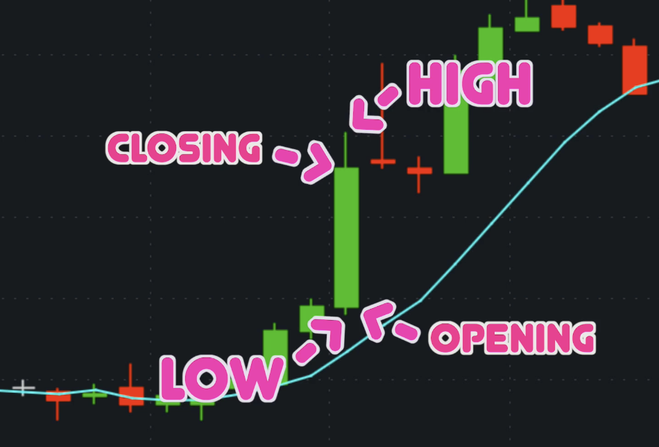
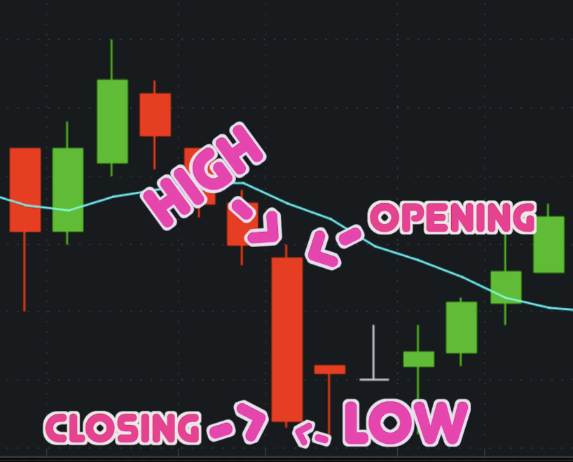

# Evaluation & Risks vs Rewards

As traders, we have to understand what moves the price action.

Good news and bad news about a company are both overreactions.

Use price actions to:
- Breakdown opportunities
- Confirm good setups
- Find great execution points

## Candle sticks

### Green candle sticks

Bullish period

### Red candle sticks

Bearish period

